## Project Structure
### Model structure
#### Boss is used as an guideline / concept - not developed as of time of writing

### View Structure

### Example Flowchart: Combat Controller

### Example Sequence Loop: Arena

```mermaid
sequenceDiagram
    participant Player as Player Character
    participant ArenaLoop
    participant BattlePrompt
    participant CombatController
    participant Animations
    participant HealthDisplay
    participant NPC as NPC Character

    ArenaLoop ->> Player: Instantiate
    ArenaLoop ->> NPC: Instantiate using getRandomEnemy()

    loop While both Player and NPC are alive
        ArenaLoop ->> BattlePrompt: actionPrompt(Player, NPC)
        BattlePrompt -->> Player: Display prompt
        Player -->> ArenaLoop: playerChoice
        ArenaLoop ->> CombatController: takeTurn(playerChoice, Player, NPC)
        CombatController -->> Player: Perform action
        CombatController -->> NPC: Apply effects of Player action
        ArenaLoop ->> Animations: sleep(1000ms)

        ArenaLoop ->> ArenaLoop: getNonPlayingCharacterChoice()
        ArenaLoop -->> NPC: npcChoice
        ArenaLoop ->> CombatController: takeTurn(npcChoice, NPC, Player)
        CombatController -->> NPC: Perform action
        CombatController -->> Player: Apply effects of NPC action
        ArenaLoop ->> Animations: sleep(1000ms)

        ArenaLoop ->> ArenaLoop: turnSummary(NPC, Player, roundNumber)
        ArenaLoop ->> Animations: animateLine(25, "🔄", 50)
        ArenaLoop ->> HealthDisplay: healthStatus(Player, NPC)
        HealthDisplay -->> Player: Display health
        HealthDisplay -->> NPC: Display health
        ArenaLoop ->> Animations: animateLine(25, "⎯", 100)
        ArenaLoop ->> Animations: sleep(500ms)
    end

```

### Utils Diagram
